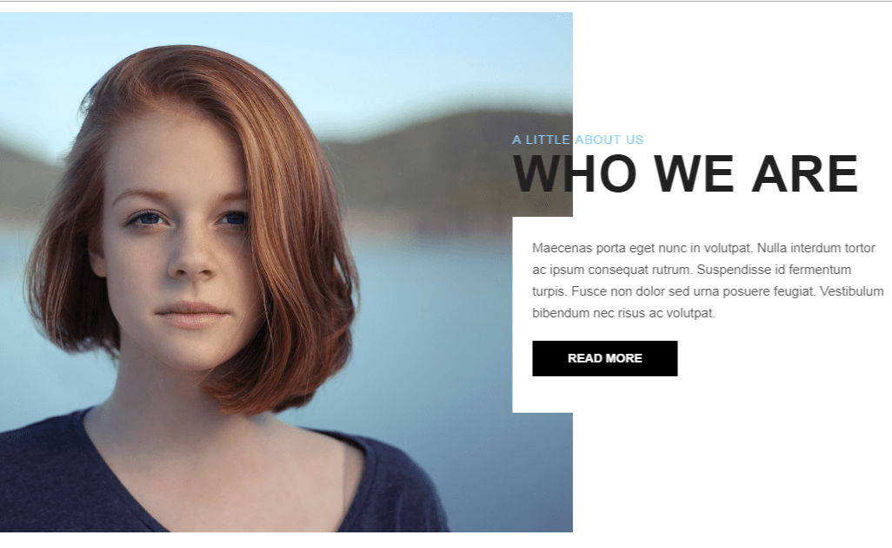

# Area-scroll
#### (Анимированный скролинг страницы на jQuery)
***
## Вы можете скачать "Area-scroll page" Zip архивом.

[](github.com/AndreiKaragayr/module_kai-scroll.git)


***
### Про библиотеку:
1. Area-scroll - это библиотека, которая оживляет страницу, её задача превращать ваши картинки и контент в блоки и анимировать их.
2. Area-scroll уже Adaptive, Вам ненужно делать мобильную версию, библиотекой предусмотрена Adaptive версия.
3. В Area-scroll содержит возможность создания progress-bar, он настраиваемый, это очень удобно если вам есть чем похвастаться перед клиентами. progress-bar может быть во всех блоках.
4. В Area-scroll предусмотрено 4 вида анимации. Один из главных плюсов библиотеки, это то что можно написать свои анимации и легко подключить её. Можно использовать 1 анимацию для всех блоков или на каждом блоке разную.
5. Area-scroll настраиваемая библиотека которая содержит настройки в файле `area_scroll.js` :
  + `offset:` - скролинг появится позже на 100px
  + `transitionTnsf:` -  время скольжения progress-bar
  + `cotorSubtitle:`  -  цвет малого заголовка
  + `colorHeading:` - цвет большого заголовка
  + `colorBar:` - цвет progress-bar
***
### Как установить:
Подключить Css:
```
	<link rel="stylesheet" href="css/font-awesome.min.css"> // Модуль использует иконки awesome
	<link rel="stylesheet" href="css/area_scroll.css">  // стили модуля
```
Ваш HTML:
```
<div class="area-scroll animation-space">
	<div class="wr-image"> Ваша Картинка </div>
	<div class="wr-heading"> Ваш Заголовок </div>
	<div class="wr-text"> Ваш текст </div>
	<div class="wr-progress-bar" data-value="90" data-unit="%">Web design</div>
</div>
```

Подключить JavaScript:
```
<script src="js/area_scroll.js"></script>
```
***
#### Мануал:
**Прописаны 4 вида анимации:**
1. animation-from-side
2. animation-rotate
3. animation-door
4. animation-space
Название выбраной анимации вставляется в Код рядом с area-scroll:
```
<div class="area-scroll animation-from-side">
...
```
**Для кнопки нужно прописать свой класс btn-area:**

```
...
  <div class="wr-text"> Ваш текст </div>
  <a href="#" class="btn-area">Read more</a>
</div>
```
Так вы получите анимированную кнопку, которую можно дополнять стилями.

**Как заполнить progress-bar**
Progress-bar может быть во всех area-scroll, один, два или больше.
Для того что бы заполнить  нужно три значения это счетчик data-value, еденица измерения data-unit и название:

```
<div class="wr-progress-bar" data-value="90" data-unit="%">Web design</div>
<div class="wr-progress-bar" data-value="95" data-unit="%">Development</div>
<div class="wr-progress-bar" data-value="85" data-unit="%">Video/audio</div>
<div class="wr-progress-bar" data-value="88" data-unit="%">Interactive media</div>
<div class="wr-progress-bar" data-value="90" data-unit="%">Photography</div>
<div class="wr-progress-bar" data-value="95" data-unit="%">Graphic design</div>
```

